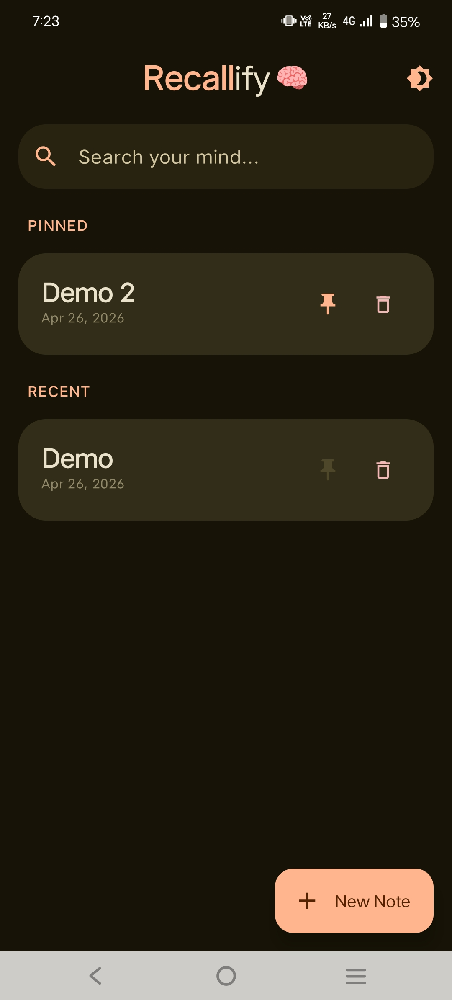
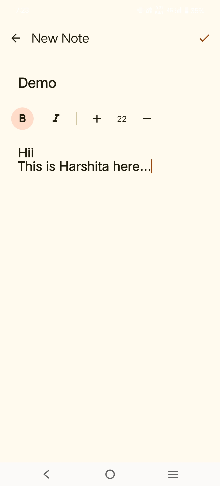

# Recallify 🧠

**Recallify** is a sleek, modern, and minimal note-taking application built with **Jetpack Compose**. It focuses on performance and ease of use, providing a clean interface to organize your thoughts and tasks.

## ✨ Features

- **Modern UI**: Beautifully crafted with Material 3 and Jetpack Compose.
- **Dark Mode Support**: Seamlessly switch between light and dark themes.
- **Pin Notes**: Keep your most important notes at the top for quick access.
- **Search**: Fast, real-time search to find your notes instantly.
- **Persistence**: Powered by **Room Database** for local storage and **DataStore** for preferences.
- **Undo Actions**: Accidentally deleted a note? Use the "Undo" snackbar to bring it back.

---

## 📸 Screenshots

| Home Screen (Light) | Note Details / Editing |
| :---: | :---: |
|  |  |

| Dark Mode | Search & Empty State |
| :---: | :---: |
|  |  |

*(Note: Create a `screenshots` folder in the root and add your images with these names, or update the links above)*

---

## 🛠️ Tech Stack

- **Language**: Kotlin
- **UI Framework**: Jetpack Compose (Material 3)
- **Database**: Room Persistence Library
- **Preferences**: Jetpack DataStore
- **Architecture**: MVVM (Model-View-ViewModel)
- **Concurrency**: Kotlin Coroutines & Flow

---

## 📂 Project Structure

```text
Recallify/
├── app/
│   ├── src/main/java/com/recallify/app/
│   │   ├── data/                 # Data Layer
│   │   │   ├── local/            # Local Storage
│   │   │   │   ├── dao/          # Room DAOs
│   │   │   │   ├── database/     # Room Database setup
│   │   │   │   ├── datastore/    # DataStore (Theme preferences)
│   │   │   │   └── entity/       # Room Entities (Note models)
│   │   │   └── repository/       # Repository Pattern implementation
│   │   ├── ui/                   # UI Layer
│   │   │   ├── components/       # Reusable Compose components
│   │   │   └── theme/            # Theme, Color, Type definitions
│   │   ├── viewmodel/            # ViewModels (State management)
│   │   └── MainActivity.kt       # Single Activity entry point
│   └── build.gradle.kts          # App dependencies & configuration
├── gradle/
└── README.md
```

---

## 🚀 Getting Started

1. **Clone the repository**:
   ```bash
   git clone https://github.com/yourusername/Recallify.git
   ```
2. **Open in Android Studio**:
   Import the project and wait for Gradle sync to complete.
3. **Run**:
   Select your emulator or physical device and click the **Run** button.

---

## 📜 License

```text
Copyright 2024 Recallify

Licensed under the Apache License, Version 2.0 (the "License");
you may not use this file except in compliance with the License.
You may obtain a copy of the License at

    http://www.apache.org/licenses/LICENSE-2.0
```

---
*Developed with ❤️ by Your Name*
